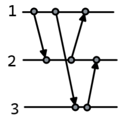
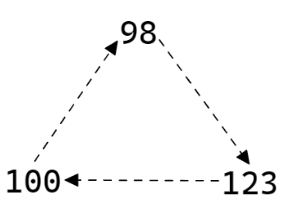
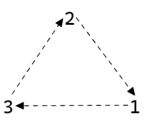

# Project Documentation

**Programming Language:** `Python`

**Prerequisites:**

- Install python.
- Install the following libraries:
    - socket
    - termcolor
    - random
    - time
    - pyfiglet
- Atleast 2 machines are required to execute the program.
- It is recommended to have all these machines connected to the same network. Otherwise, the program may not work, since issues may arise due to port forwarding.
- Keep IP addresses of all machines handy.
- Keep input files in the same directory as the python program.

**Folder Structure:**

```
|-- Chat-App/
        |-  gen.py
        |-  app.py
        |-  input.txt
|-- Leader-Election/
        |-  gen.py
        |-  app.py
        |-  input.txt
|-- Mutual-Exclusion/
        |-  gen.py
        |-  app.py
        |-  input.txt
|-- Images/
		|-  1.png
		|-  2.png
		|-  3.png
|-- Readme.md
|-- Readme.pdf
|-- Report.pdf
```

## Part I - Distributed Chat App

In this part, we implement a distributed chat application using python. As per the instructions, we are generating an `input.txt` file which contains the number of users, IP address of users and their ID, and a list of messages to be exchanged between users in a chat group.

**Code:** `/Chat-App/`

**How to generate input file:**

```
python gen.py <n> <m> <IPs>
```

- `n`: number of users in a chat group
- `m`: number of messages to be exchanged between users
- `IPs`: IP addresses of all users in chat group separated by space
- Example: `python gen.py 3 4 1.1.1.1 1.1.1.2 1.1.1.3`

**Specification of input file:**

Sample input file:

```
3
1 1.1.1.1
2 1.1.1.2
3 1.1.1.3
1|2|Hi Machine 2
1|3|Hello machine 3
2|1|Hey machine 1
3|2|How are you machine 2
```

- First line contains number of users in chat group, say `n`
- The next `n` lines contain the ID and IP address of users separated by space.
- The next `m` lines contain messages to be exchanged between users in the chat group.
    - Each line contains sender ID, receiver ID, and message separated by `|`.
- Space time graph for above messages:
    
    
    

**How to execute:**

```
python app.py
```

- Will start the chat application.
- Parses the input files and starts sending and receiving messages based on the input file.

---

## Part II - Algorithms

### Leader Election - Chang-Roberts Algorithm

We implemented the Chang-Roberts algorithm to elect a leader in a distributed system. The algorithm is based on the fact that nodes are arranged in a circle. The leader is the node that has the largest ID among all participating nodes. In this case, we assign random IDs to nodes during the input file generation phase.

**Code:** `/Leader-Election/`

**How to generate input file:**

```
python gen.py <n> <IPs>
```

- `n`: number of users in group
- `IPs`: IP addresses of all users in chat group separated by space
- Example: `python gen.py 3 1.1.1.1 1.1.1.2 1.1.1.3`

**Specification of input file:**

Sample input file:

```
3
123 1.1.1.1
98 1.1.1.2
100 1.1.1.3
98 123 100 98
```

- First line contains number of users in the ring, say `n`
- The next `n` lines contain the ID and IP address of users separated by space.
- Next line contains the order of nodes in the circle.
    - In the above example, the order of nodes is `98 123 100 98`.
    - This nodes are arranges in circle as: `98 -> 123 -> 100 -> 98`.
- Ring representation of the above example:



**How to execute:**

```
python app.py
```

- Will start the app.
- Parses the input file and passes some messages to find the leader among the nodes.
- Once the leader is found, it will send the leader’s ID to all the nodes, claiming itself as leader.

---

### Mutual Exclusion - Ring Based mutual exclusion Algorithm

We implemented the Ring Based mutual exclusion algorithm to achieve mutual exclusion while executing the critical section. The algorithm is based on the fact that nodes are arranged in a circle. There is only one token among all nodes. The node which has the token and wants to execute the critical section will execute the critical section and pass the token to its successor after its execution. If the node has a token and does not wish to execute the critical section, it will pass the token to its successor.

**Code:** `/Mutual-Exclusion/`

**How to generate input file:**

```
python gen.py <n> <IPs>
```

- `n`: number of users in ring
- `IPs`: IP addresses of all users in chat group separated by space
- Example: `python gen.py 3 1.1.1.1 1.1.1.2 1.1.1.3`

**Specification of input file:**

Sample input file:

```
3
1 1.1.1.1
2 1.1.1.2
3 1.1.1.3
2 1 3 2
0 1 1
0 0 1
0 1 1
1 1 1
0 0 1
```

- First line contains the number of users in the ring, say `n`.
- Next `n` lines contain ID and IP address of users separated by space.
- The next one line contains the order of nodes in the circle.
    - In the above example, the order of nodes is `2 1 3 2`.
    - This nodes are arranges in circle as: `2 -> 1 -> 3 -> 2`.
- Ring representation of above example:
    
    
    
- Next 5 lines, contain `n` binary values. Treat it as 0-indexed matrix of `5xn`. In above example, the matrix is: `[[0, 1, 1], [0, 0, 1], [0, 1, 1], [1, 1, 1], [0, 0, 1]]`
    - `mat[j][i] == 0` means Node with ID `i+1` do not want to enter critical section in `jth` round.
    - `mat[j][i] == 1` means Node with ID `i+1` wants to enter critical section in `jth` round.

**How to execute:**

```
python app.py
```

- Will start the program for mutual exclusion.
- Initially token is with Node 1.
- Any node `i` wishing to enter critical section, must wait for token to be received from parent node.

---